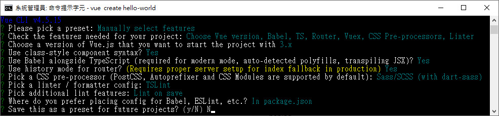

# Day01 - Vue.js 開發環境建置

Vue.js 的開發環境建置有以下幾種方法：

-   使用 CDN 或下載後使用本機檔案
-   使用 vue-cli(腳手架)

# 使用 CDN 或下載後使用本機檔案

# 使用 vue-cli(腳手架)

## 安裝 vue-cli

```
npm install -g @vue/cli
# OR
yarn global add @vue/cli
```

## vue -V 檢查版本

```
vue -V
```

## 搭建專案

運行以下命令來創建一個新項目

```
vue create hello-world
```

這時候我們選擇第三項手動選擇。選擇的時候按 Enter 鍵就可以實現。(如果這時候你沒有下面的三個選項，說明的 vue-cli 是舊版本，需要你更新。)

```
? Please pick a preset: (Use arrow keys)            // 請選擇預選項
  Default ([Vue 2] babel, eslint)                   // 使用Vue2預設模板進行建立
  Default (Vue 3 Preview) ([Vue 3] babel, eslint)   // 使用Vue3預設模板進行建立
> Manually select features                          // 手動選擇(自定義)的意思
```

選擇 TypeScript 的選項，然後再按 Enter 鍵進入下一層選擇

```
? Check the features needed for your project: (Press <space> to select, <a> to toggle all, <i> to invert selection)

> (*) Choose Vue version                // 選擇 Vue 版本
> (*) Babel                             // javascript 轉譯器
> (*) TypeScript                        // 使用 TypeScript 編寫源碼
> ( ) Progressive Web App (PWA) Support // 漸進式 WEB 應用
> (*) Router                            // 使用 vue-router
> (*) Vuex                              // 使用 vuex
> (*) CSS Pre-processors                // CSS 前處理器
> (*) Linter / Formatter                // 格式化工具
> ( ) Unit Testing                      // 單元測試
> ( ) E2E Testing                       // E2E 測試
```

這裡要選擇 3.x Vue.js 的版本，按下 Enter 鍵，

```
? Choose a version of Vue.js that you want to start the project with (Use arrow keys)
  2.x
> 3.x (Preview)
```

是否使用 Class 風格裝飾器？

-   即原本是：home = new Vue() 創建 vue 實體化
-   使用裝飾器後：class home extends Vue{}

```
? Use class-style component syntax? (y/N) N
```

是否使用 TypeScript 和 Babel 的形式編譯 JSX.這裡我們也選擇 Y

```
? Use Babel alongside TypeScript (required for modern mode,auto-detected polyfills, transpiling JSX)? (Y/n) Y
```

路由模式

```
? Use history mode for router? (Requires proper server setup for index fallback in production) (Y/n)
```

我選擇 Sass/SCSS (with dart-sass)

```
> Sass/SCSS (with dart-sass) // 保存後編譯
> Sass/SCSS (with node-sass) // 實時編譯
> Less
> Stylus
```

選擇代碼格式化檢測

> 因為是用 typescript 所以選擇 TSLint

```
? Pick a linter / formatter config: (Use arrow keys)
  ESLint with error prevention only // 只進行抱錯提醒
  ESLint + Airbnb config // 不嚴謹模式
  ESLint + Standard config // 正常模式
  ESLint + Prettier // 嚴格模式
> TSLint (deprecated) // typescript 格式驗證工具
```

代碼檢查方式 保存時檢查

```
? Pick additional lint features: (Press <space> to select, <a> to toggle all, <i> to invert selection)

> (*) Lint on save
> ( ) Lint and fix on commit
```

文件配置

```
? Where do you prefer placing config for Babel, ESLint, etc.?
  In dedicated config files
> In package.json
```

將此保存為未來項目的預設？

```
? Save this as a preset for future projects? (y/N) N
```

配置預覽


OK，等待項目加載各種包...
加載完畢

```
$ cd hello-world
$ yarn serve
```

在瀏覽器網址列打上 [http://localhost:8008](http://localhost:8008)，即可看到歡迎頁面。
