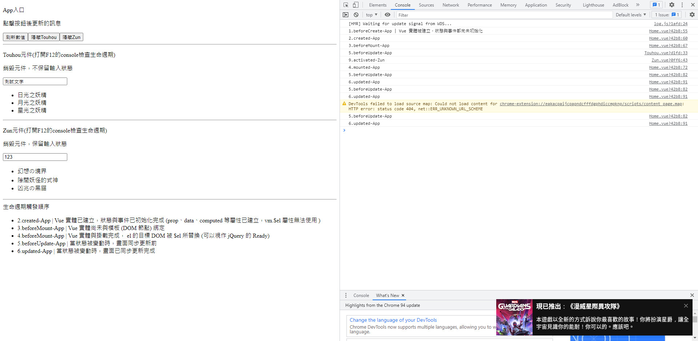

# Day01 - Vue 元件的生命週期與更新機制

## 專案安裝

```
yarn install
```

### 開發編譯和熱重載

```
yarn serve
```

### 專案環境

-   vue + typescript
-   Vuex
-   Router

### 線上預覽

https://codepen.io/pratnket/pen/VwzpqJr?editors=1010

### 預覽畫面



### 前言

---

生命週期:

-   beforeCreate
    -   Vue 實體被建立，狀態與事件都尚未初始化
-   created
    -   Vue 實體已建立，狀態與事件已初始化完成 (prop、data、computed 等屬性已建立，vm.$el 屬性無法使用 )
-   beforeMount
    -   Vue 實體尚未與模板 (DOM 節點) 綁定
-   mounted
    -   實體與掛載完成， el 的目標 DOM 被 $el 所替換 (可以視作 jQuery 的 Ready)
-   beforeUpdate
    -   Vue 實體尚未與模板 (DOM 節點) 綁定
-   updated
    -   Vue 當狀態被變動時，畫面已同步更新完成
-   beforeDestroy
    -   (2.X)Vue 實體物件被銷毀前
-   beforeUnmount
    -   (3.0)Vue 實體物件被銷毀前
-   destroyed (2.X)
    -   Vue 實體物件被銷毀完畢
-   unmounted (3.0)
    -   Vue 實體物件被銷毀完畢
-   errorCaptured
    -   子/孫代元件的錯誤被捕獲時觸發
-   activated
    -   Vue 元件被啟動時觸發，搭配 keep-alive 使用
-   deactivated
    -   Vue 元件被解除時觸發，搭配 keep-alive 使用

### 生命週期與 Hooks function

---


```
// Views/Home.vue

<template>
  <div class="home">
    <p>App入口</p>
    <p>{{ message }}</p>
    <button v-on:click="getRemoteMessage">刷新數值</button>
    <button @click="ToggleTouhouClick">{{ ToggleTouhouStatus }}Touhou</button>
    <button @click="ToggleZunClick">{{ ToggleZunStatus }}Zun</button>
    <hr />
    <Touhou v-if="ToggleTouhou" />
    <hr />
    <keep-alive>
      <component :is="ComponentsName" v-if="ToggleZun"></component>
    </keep-alive>
    <hr />
    <div>生命週期觸發順序</div>
    <ul>
      <li v-for="(item, index) in outputs" :key="index">{{ item }}</li>
    </ul>
  </div>
</template>
```

```
// Views/Home.vue

<script lang="ts">
import { Component, Prop, Vue } from "vue-property-decorator";
import Touhou from "@/components/Touhou.vue";
import Zun from "@/components/Zun.vue";

@Component({
  components: {
    Touhou,
    // eslint-disable-next-line vue/no-unused-components
    Zun,
  },
})
export default class Home extends Vue {
  // 訊息
  private message = "初始化訊息";

  // Touhou元件
  private ToggleTouhou = true;
  private ToggleTouhouStatus = "隱藏";
  // Zun元件
  private ToggleZun = true;
  private ToggleZunStatus = "隱藏";

  // 切換元件
  private ComponentsName = "Zun";

  // 調試訊息次數，防止重覆刷新
  private outputsCount = 0;
  // 調試訊息
  private outputs: Array<string> = [];

  private beforeCreate() {
    // Vue 實體被建立，狀態與事件都尚未初始化
    console.log("1.beforeCreate-App | Vue 實體被建立，狀態與事件都尚未初始化");
  }

  private created() {
    // Vue 實體已建立，狀態與事件已初始化完成 (prop、data、computed 等屬性已建立，vm.$el 屬性無法使用 )
    console.log("2.created-App");
    this.outputs.push(
      "2.created-App | Vue 實體已建立，狀態與事件已初始化完成 (prop、data、computed 等屬性已建立，vm.$el 屬性無法使用 )"
    );
  }
  private beforeMount() {
    // Vue 實體尚未與模板 (DOM 節點) 綁定
    console.log("3.beforeMount-App");
    this.outputs.push("3.beforeMount-App | Vue 實體尚未與模板 (DOM 節點) 綁定");
  }
  private mounted() {
    // Vue 實體與掛載完成， el 的目標 DOM 被 $el 所替換 (可以視作 jQuery 的 Ready)
    console.log("4.mounted-App");
    this.outputs.push(
      "4.beforeMount-App | Vue 實體與掛載完成， el 的目標 DOM 被 $el 所替換 (可以視作 jQuery 的 Ready)"
    );
  }
  /**
   * 初始化不會觸發
   */
  private beforeUpdate() {
    // 當狀態被變動時，畫面同步更新前
    console.log("5.beforeUpdate-App");
    if (this.outputsCount < 2) {
      this.outputs.push("5.beforeUpdate-App | 當狀態被變動時，畫面同步更新前");
      // 防止一直刷新
      this.outputsCount += 1;
    }
  }
  private updated() {
    // 當狀態被變動時，畫面已同步更新完成
    console.log("6.updated-App");
    if (this.outputsCount < 2) {
      this.outputs.push("6.updated-App | 當狀態被變動時，畫面已同步更新完成");
      // 防止一直刷新
      this.outputsCount += 1;
    }
  }
  private errorCaptured(err: any, component: any, details: any) {
    // 子/孫代元件的錯誤被捕獲時觸發
    console.log("9.errorCaptured-Touhou");
    console.log(err, component, details);
    this.outputs.push("9.updated-App");
  }

  private getRemoteMessage() {
    Promise.resolve("點擊按鈕後更新的訊息")
      .then((res) => {
        if (this.message === "初始化訊息") {
          this.message = res;
        } else {
          this.message = "初始化訊息";
        }
      })
      .then(() => {
        // 清零計數器
        this.outputsCount = 0;
      });
  }
  private ToggleTouhouClick() {
    // 透過 v-if 來達成子組件的銷毀
    // v-show 只會隱藏起來，html還是存在
    this.ToggleTouhou = !this.ToggleTouhou;
    // 按鈕文字的變更
    if (this.ToggleTouhouStatus === "隱藏") {
      this.ToggleTouhouStatus = "顯示";
    } else {
      this.ToggleTouhouStatus = "隱藏";
    }
    // 清零計數器
    this.outputsCount = 0;
  }

  private ToggleZunClick() {
    // 透過 v-if 來達成子組件的銷毀
    // v-show 只會隱藏起來，html還是存在
    this.ToggleZun = !this.ToggleZun;
    // 按鈕文字的變更
    if (this.ToggleZunStatus === "隱藏") {
      this.ToggleZunStatus = "顯示";
    } else {
      this.ToggleZunStatus = "隱藏";
    }
    // 清零計數器
    this.outputsCount = 0;
  }
}
</script>
```

```
// Components/Touhou.vue

<template>
  <div>
    <p>Touhou元件(打開F12的console檢查生命週期)</p>
    <p>銷毀元件，不保留輸入狀態</p>
    <input type="text" />
    <ul>
      <li v-for="(item, index) in menuItems" :key="index">{{ item.text }}</li>
    </ul>
  </div>
</template>

<script lang="ts">
import { Component, Prop, Vue } from "vue-property-decorator";

@Component
export default class Touhou extends Vue {
  private count = 0;

  private menuItems: { text: string }[] = [
    {
      text: "日光之妖精",
    },
    {
      text: "月光之妖精",
    },
    {
      text: "星光之妖精",
    },
  ];

  private mounted() {
    // 當狀態被變動時，畫面同步更新前
    console.log("5.beforeUpdate-App");
    // 故意引發錯誤讓 errorCaptured 捕捉
    // a
  }

  private activated() {
    // Vue 元件被啟動時觸發，搭配 keep-alive 使用
    console.log("9.activated-Zun");
  }

  private deactivated() {
    // Vue 元件被解除時觸發，搭配 keep-alive 使用
    console.log("10.deactivated-Zun");
  }
}
</script>
```

```
// Components/Zun.vue

<template>
  <div>
    <p>Zun元件(打開F12的console檢查生命週期)</p>
    <p>銷毀元件，保留輸入狀態</p>
    <input type="text" />
    <ul>
      <li v-for="(item, index) in menuItems" :key="index">{{ item.text }}</li>
    </ul>
  </div>
</template>

<script lang="ts">
import { Component, Prop, Vue } from "vue-property-decorator";

@Component
export default class Zun extends Vue {
  private count = 0;

  private menuItems: { text: string }[] = [
    {
      text: "幻想の境界",
    },
    {
      text: "隙間妖怪的式神",
    },
    {
      text: "凶兆の黑貓",
    },
  ];

  private beforeUnmount() {
    // Vue 實體物件被銷毀前
    console.log("7.beforeUnmount-Zun");
  }

  private unmounted() {
    // Vue 實體物件被銷毀完畢
    console.log("8.unmounted-Zun");
  }

  private activated() {
    // Vue 元件被啟動時觸發，搭配 keep-alive 使用
    console.log("9.activated-Zun");
  }

  private deactivated() {
    // Vue 元件被解除時觸發，搭配 keep-alive 使用
    console.log("10.deactivated-Zun");
  }
}
</script>
```
