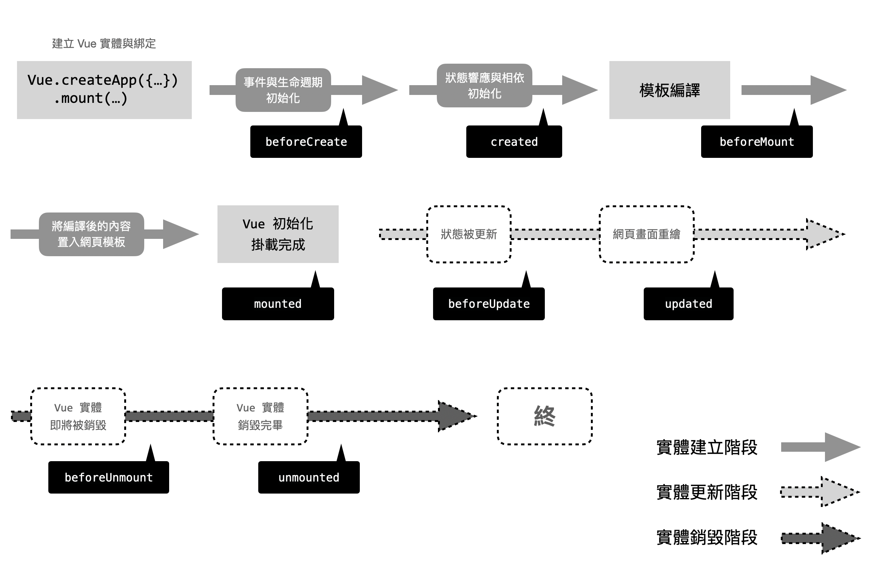

# Day02 - Vue 元件的生命週期與更新機制

<!-- 目錄 -->

  
目錄

  <ol>
    <li>
      <a href="#生命週期圖">生命週期圖</a>
    </li>
    <li>
      <a href="#程式碼預覽">程式碼預覽</a>
      <ul>
        <li><a href="#Q1">創建實例時</a></li>
        <li><a href="#Q2">掛載到 DOM 時</a></li>
        <li><a href="#Q3">狀態被更新、網頁畫面重繪</a></li>
      </ul>
    </li>
    <li>
      <a href="#專案指令">專案指令</a>
    </li>
    <li>
      <a href="#專案環境">專案環境</a>
    </li>
    <li>
      <a href="#生命週期">生命週期</a>
      <ul>
        <li>
          <a href="#創建實例時">創建實例時</a>
          <ul>
            <li><a href="#beforeCreate">beforeCreate</a></li>
            <li><a href="#created">created</a></li>
          </ul>
        </li>
        <li>
          <a href="#掛載到 DOM 時">掛載到 DOM 時</a>
          <ul>
            <li><a href="#beforeMount">beforeMount</a></li>
            <li><a href="#mounted">mounted</a></li>
          </ul>
        </li>
        <li>
          <a href="#更改數據或更新畫面時">更改數據或更新畫面時</a>
          <ul>
            <li><a href="#beforeUpdate">beforeUpdate</a></li>
            <li><a href="#updated">updated</a></li>
          </ul>
        </li>
      </ul>
    </li>
  </ol>

## 生命週期圖

## 程式碼預覽

-   ## Q1
    -   ## 建立實體 Vue 與綁定
        -   beforeCreate、created
            -   https://codepen.io/pratnket/pen/vYJpJQM

-   ## Q2
    -   ## 模板編譯
        -   beforeMount、mounted
            -   https://codepen.io/pratnket/pen/abyqvze

-   ## Q3
    -   ## 狀態被更新、網頁畫面重繪
        -   beforeMount、mounted
            -   https://codepen.io/pratnket/pen/BadYjYg

## 專案指令

-   yarn install // 專案安裝
-   yarn serve // 開發編譯和熱重載

## 專案環境

-   ESM 模組化技術
-   "vue": "^2.6.11"
-   "typescript": "~4.1.5"
-   "vuex": "^3.4.0"
-   "vue-router": "^3.2.0"

## 生命週期

Vue 的實體物件從建立、掛載、更新，到銷毀移除，這一連串的過程，我們將它稱作生命週期。 在這個過程中， Vue.js 提供了開發者在這些週期階段做對應處理的 callback function， 這些 callback function 我們就稱它叫生命週期的 Hooks function。

-   beforeCreate
    -   官方解釋
        -   Vue 實體被建立，狀態與事件都尚未初始化
    -   六角學院
        -   元件實體剛被建立,屬性計算之前。
-   created
    -   官方解釋
        -   Vue 實體已建立，狀態與事件已初始化完成 (prop、data、computed 等屬性已建立，vm.$el 屬性無法使用 )
    -   六角學院
        -   元件實體已建立,屬性已綁定,但 DOM 還沒生成。
-   beforeMount
    -   官方解釋
        -   Vue 實體尚未與模板 (DOM 節點) 綁定
    -   六角學院
        -   模板 (template) 編譯或掛載至 HTML 之前
-   mounted
    -   官方解釋
        -   實體與掛載完成， el 的目標 DOM 被 $el 所替換 (可以視作 jQuery 的 Ready)
    -   六角學院
        -   模板 (template) 編譯或掛載至 HTML 之後
-   beforeUpdate
    -   官方解釋
        -   Vue 實體尚未與模板 (DOM 節點) 綁定
    -   六角學院
        -   元件被更新之前
-   updated
    -   官方解釋
        -   Vue 當狀態被變動時，畫面已同步更新完成
    -   六角學院
        -   元件被更新之後
-   beforeDestroy
    -   官方解釋
        -   Vue 實體物件被銷毀前
    -   六角學院
        -   元件被銷毀前呼叫
-   beforeUnmount
    -   官方解釋
        -   Vue 實體物件被銷毀前
    -   六角學院
        -   元件被銷毀前呼叫
-   destroyed (2.X)
    -   官方解釋
        -   Vue 實體物件被銷毀完畢
    -   六角學院
        -   元件被銷毀後呼叫
-   unmounted (3.0)
    -   官方解釋
        -   Vue 實體物件被銷毀完畢
    -   六角學院
        -   元件被銷毀後呼叫
-   errorCaptured
    -   官方解釋
        -   子/孫代元件的錯誤被捕獲時觸發
    -   六角學院
        -   無解釋
-   activated
    -   官方解釋
        -   Vue 元件被啟動時觸發，搭配 keep-alive 使用
    -   六角學院
        -   keep-alive 用,元件被啟動時呼叫
-   deactivated
    -   官方解釋
        -   Vue 元件被解除時觸發，搭配 keep-alive 使用
    -   六角學院
        -   keep-alive 用,元件被移除時呼叫

## 創建實例時

-   創建實例時會調用以下兩個鉤子。
<!-- beforeCreate -->

  -   ### beforeCreate:

      -   類型:Function
      -   詳細說明:
          在實例初始化之後、進行數據偵聽和事件/偵聽器的配置之前同步調用。

<!-- created -->

  -   ### created

      -   類型:Function
      -   詳細說明:
          在實例創建完成後被立即同步調用。在這一步中，實例已完成對選項的處理，意味著以下內容已被配置完畢：數據偵聽、計算屬性、方法、事件/偵聽器的回調函數。然而，掛載階段還沒開始，且 $el property 目前尚不可用。

## 掛載到 DOM 時

-   當組件被激活時會調用以下鉤子。

<!-- beforeMount -->

  -   ### beforeMount

      -   類型：Function
      -   詳細：
          在實例初始化之後、進行數據偵聽和事件/偵聽器的配置之前同步調用。

<!-- mounted -->

  -   ### mounted

      -   類型：Function
      -   詳細：
          在實例創建完成後被立即同步調用。在這一步中，實例已完成對選項的處理，意味著以下內容已被配置完畢：數據偵聽、計算屬性、方法、事件/偵聽器的回調函數。然而，掛載階段還沒開始，且 $el property 目前尚不可用。

## 更改數據或更新畫面時

-   更改數據或更新屏幕時會調用以下兩個鉤子。

  -   ### beforeUpdate

      -   類型：Function
      -   詳細：
        在數據發生改變後，DOM 被更新之前被調用。這裡適合在現有 DOM 將要被更新之前訪問它，比如移除手動添加的事件監聽器。
        該鉤子在服務器端渲染期間不被調用，因為只有初次渲染會在服務器端進行。

  -   ### updated

      -   類型：Function
      -   詳細：
          在數據更改導致的虛擬 DOM 重新渲染和更新完畢之後被調用。
          當這個鉤子被調用時，組件 DOM 已經更新，所以你現在可以執行依賴於 DOM 的操作。然而在大多數情況下，你應該避免在此期間更改狀態。如果要相應狀態改變，通常最好使用計算屬性或偵聽器取而代之。
